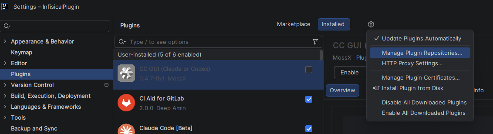
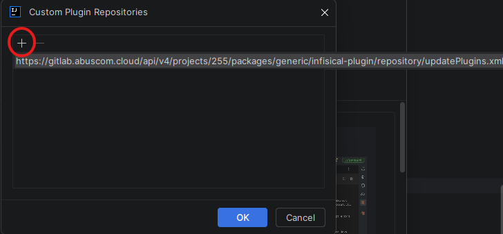
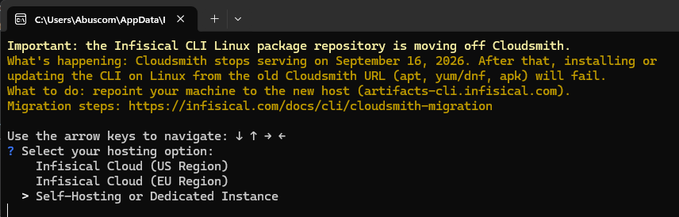
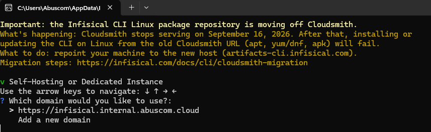
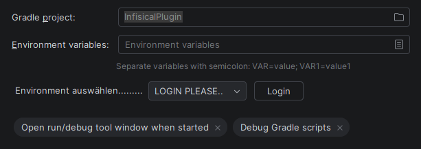

# Plugin Installation & Nutzung

> **Unterstützte IDEs:** IntelliJ IDEA Ultimate (Gradle/Spring-Boot-/Maven-/Python-Integration). Für
> die npm-Integration wird zusätzlich das gebundelte NodeJS-Plugin benötigt (in IntelliJ IDEA
> Ultimate bereits enthalten, z. B. auch über WebStorm nutzbar). Für die Python-Integration werden
> zusätzlich die Marketplace-Plugins **PythonCore** und **Pythonid** benötigt (Python-Support ist
> nicht automatisch in Ultimate enthalten, muss separat installiert werden).

## Funktionalitäten

- **Browser-basierter Login:** Anmeldung erfolgt einmalig über die Infisical-Weboberfläche; das Plugin startet dafür kurzzeitig einen lokalen Callback-Server (`localhost:8010`), der das JWT-Token entgegennimmt.
- **Sichere Token-Speicherung:** Das Token wird über die IntelliJ PasswordSafe-API gespeichert, nicht im Klartext.
- **Automatische Ablaufprüfung:** Vor jedem Start wird geprüft, ob das gespeicherte Token noch gültig ist (JWT-Expiry). Ist es abgelaufen, wird es automatisch verworfen und die Login-Option erscheint wieder.
- **Environment-Auswahl:** Über ein Dropdown in der Run-Configuration (bzw. im Infisical-Tab bei npm) lässt sich pro Konfiguration die gewünschte Umgebung (z. B. `dev`, `prod`) auswählen.
- **Automatische Secret-Injection:** Beim Start einer aktivierten Run-Configuration (Gradle/SpringBoot, Maven, npm/Node oder Python) werden die Secrets des gewählten Environments automatisch als Umgebungsvariablen in den gestarteten Prozess injiziert — keine lokalen `.env`-Dateien mehr nötig.
- **Standardmäßig deaktiviert:** Neu angelegte Run-Configurations haben die Infisical-Injection zunächst deaktiviert; sie muss pro Run-Configuration explizit aktiviert werden (Gradle/Spring Boot/Maven/Python: **Modify options** → Haken bei **Infisical**).
- **Frischer Secret-Abruf bei jedem Start:** Vor jedem Start einer aktivierten Run-Configuration werden die Secrets des gewählten Environments direkt von der Infisical-Cloud abgerufen — kein lokales Zwischenspeichern zwischen Starts, kein Versionsabgleich. Änderungen in der Web-UI sind damit beim nächsten Start sofort wirksam.
- **Lokale Overrides (`.infisical.local.json`):** Für maschinenspezifische Pfade lassen sich einzelne Secret-Werte lokal überschreiben, ohne die zentralen Cloud-Werte zu verändern; diese Overrides überleben einen Environment-Wechsel.
- **Automatisches Tagging machine-spezifischer Secrets:** Secrets, die als lokaler Pfad-Override erkannt werden (siehe oben), werden zusätzlich in Infisical selbst mit dem Tag `specificpaths` versehen — damit Teammitglieder sie in der Infisical-Web-App per Tag-Filter finden und dort einen eigenen Personal Override setzen können. Das Tagging ist fail-open: Schlägt es fehl (z. B. fehlende Schreibrechte), wird nur eine Warnung geloggt, das eigentliche Laden der Secrets bricht nicht ab.
- **Personal-Override-Auflösung:** Secrets werden inklusive persönlicher Overrides abgerufen — ein in der Infisical-Web-App individuell gesetzter Wert ersetzt automatisch den geteilten Wert für denselben Key beim Laden.
- **Fehlerbehandlung über Notifications:** Fehlende `.infisical.json`, ungültiges/abgelaufenes Token oder HTTP-Fehler bei der API führen zu einer IDE-Benachrichtigung statt zu einem Absturz oder stillem Fehlschlag. Der Run/Build-Prozess wird dabei nicht abgebrochen — er läuft ohne Secret-Injection weiter, genau wie bei deaktiviertem Plugin.
- **Pro-Run-Configuration persistierte Einstellungen:** Ob Infisical aktiviert ist und welches Environment gewählt wurde, wird pro Run-Configuration gespeichert und bleibt über IDE-Neustarts hinweg erhalten.

## Installation

1. In der IDE: **File > Settings > Plugins** → Zahnrad-Symbol (⚙) oben rechts → **Manage Plugin Repositories...**

   
2. Über `+` folgende URL eintragen (einmalig):

   https://gitlab.abuscom.cloud/api/v4/projects/269/packages/generic/infisical-plugin/repository/updatePlugins.xml

   

3. Im Reiter **Marketplace** nach `InfisicalPlugin` suchen und **Install** klicken.

4. IDE neu starten und prüfen, ob das Plugin unter **Plugins** aufgeführt wird.

Zukünftige Updates werden ab dann automatisch von der IDE erkannt und müssen nicht mehr manuell nachinstalliert werden.

## Infisical CLI installieren

Um Infisical selbst zu installieren (welche man im nächsten Schritt braucht) kann es mit npm folgendermaßen installiert werden:

```
npm install -g @infisical/cli
npm update -g @infisical/cli
```

Alternativ alle Installationsmöglichkeiten: https://infisical.com/docs/cli/overview#debian%2Fubuntu

## Verbindung mit der abuscom instanz

Damit man im nächsten schritt die init funktion aufrufen kann muss sich erstmals über die infisical CLI mit dem abuscom.internal server zu verbinden.



Entweder bereits bestehende internal domain auswählen oder diese hinzufügen:

```
   https://infisical.internal.abuscom.cloud
   ```



Dann wird man umgeleitet um sich einmalig anzumelden. 

## Konfiguration: `.infisical.json`

Damit das Plugin funktioniert, muss im Projekt-Root eine `.infisical.json`-Datei mit folgendem Format vorhanden sein:

```json
{
  "workspaceId": "...…..-....-....-....-............",
  "defaultEnvironment": "dev",
  "gitBranchToEnvironmentMapping": null
}
```

Diese Datei wird über folgenden Befehl erzeugt:

```bash
infisical init
```

Anschließend den Anweisungen im Terminal folgen, um die Verbindung herzustellen.

> **Hinweis:** Diese Datei enthält keine sensiblen Daten und kann daher problemlos ins Repository eingecheckt werden.

## Spezieller Fall für hardcoded machine paths

Manche Werte haben die Form eines lokalen, maschinenspezifischen Pfads (z. B. `C:/Users/...`, `/Workspace/abuscom/...`) und müssen daher für den eigenen Rechner individuell gesetzt werden. Dafür kann im selben Verzeichnis wie die `.infisical.json`-Datei manuell eine zusätzliche Datei namens `.infisical.local.json` angelegt werden. Das Plugin legt diese Datei **nicht** automatisch an — sie ist ein rein manueller, optionaler Mechanismus für seltene lokale Debugging-Fälle; existiert sie nicht, passiert einfach nichts.

Die lokalen Werte haben Vorrang vor den Werten aus Infisical — damit lässt sich bei Bedarf auch temporär ein einzelner Wert überschreiben. Beim Wechsel des Environments bleiben die lokalen Werte erhalten und müssen beim Zurückwechseln nicht erneut eingetragen werden.

Zusätzlich markiert das Plugin genau diese erkannten Secrets automatisch auch serverseitig in Infisical mit dem Tag `specificpaths` (sichtbar am Secret in der Web-App) — das ist rein informativ fürs Team und hat keinen Einfluss auf den lokalen Override hier.

Die `.infisical.local.json` hat folgende Form:

```json
{
  "TEST_CONFIG_REPOSITORY_ROOT_DIRECTORY": "",
  "TEST_CONFIG_REPOSITORY_OTHER_DIRECTORY": "",
  "TEST_CONFIG_DIRECTORY": ""
}
```

Das ist ein sehr spezieller Anwendungsfall und sollte selten vorkommen.

> **Hinweis:** Diese Datei gehört ins `.gitignore` und darf keinesfalls eingecheckt werden (sie enthält Geheimnisse wie eine `.env`-Datei).

> **Achtung:** Beim Eintragen der lokalen Werte muss extrem genau auf das erwartete Format geachtet werden — es reicht nicht immer, einfach den rohen Pfad einzutragen. Im `af-workspace`-Projekt z. B. müssen maschinenspezifische Pfade als `file:C:\...`-URI statt als reiner Pfad-String hinterlegt werden. Welches Format konkret erwartet wird, hängt davon ab, wie der jeweilige Konsument (Build-Tool, Framework, Skript) den Wert weiterverarbeitet — das muss projektspezifisch anhand des tatsächlichen File-Handlings geprüft werden, nicht pauschal angenommen werden.


## Für Gradle/SpringBoot

1. Bestehende Gradle-Run-Configuration aktivieren: Drei-Punkte-Menü neben dem Debug-Symbol → **Edit Configurations** → 
**Modify Options** → Haken bei **Infisical** setzen.

   
2. Danach erscheinen die Login-Option sowie eine Checkbox, mit der Infisical aktiviert oder pausiert werden kann.
   
3. Über das Login-Feld wirst du zur Login-Seite weitergeleitet, auf der du dich mit deinen Zugangsdaten anmeldest.
   
4. Nach dem Login kannst du über das Dropdown-Menü die gewünschte Umgebung (Environment) auswählen.
   

Sobald das Plugin aktiviert ist, können Gradle-Projekte wie gewohnt über **Run** gestartet werden. Lokale Environment-Dateien können vollständig aus dem Projektordner gelöscht werden, da die Werte jetzt über Infisical bereitgestellt werden.


## Für Maven

Aktivierung läuft identisch zu Gradle/Spring Boot: Drei-Punkte-Menü neben dem Debug-Symbol → **Edit Configurations** → **Modify Options** → Haken bei **Infisical** setzen, danach Login und Environment-Auswahl wie gewohnt.

Die injizierten Werte stehen als Umgebungsvariablen des laufenden Maven-Prozesses zur Verfügung — z. B. lesbar über `exec-maven-plugin` (`exec:java`), Tests (Surefire/Failsafe) oder jedes andere Plugin, das `System.getenv(...)` aufruft.

> **Bekannte Einschränkung:** Ob Infisical aktiviert ist und welches Environment gewählt wurde, wird für Maven-Run-Configurations aktuell **nicht** über IDE-Neustarts hinweg gespeichert (anders als bei Gradle/Spring Boot/npm) — die Checkbox muss nach einem Neustart der IDE erneut gesetzt werden.

## Für npm

Steuerung bleibt die gleiche jedoch muss Infisical nicht manuell aktiviert werden sondern kann direkt über den Reiter **Infisical** neben **Browser / Live Edit** aufgerufen werden.
   

Nach Aktivierung sind die Schritte die selbe wie bei Gradle.
> Ausführung über das terminal via npm start wird nicht unterstützt! 

## Für Python

Voraussetzung: Die Marketplace-Plugins **PythonCore** (Python Community Edition) und **Pythonid**
(Python) müssen in der IDE installiert und aktiviert sein — Python-Support ist nicht automatisch
in IntelliJ IDEA Ultimate enthalten.

Aktivierung läuft identisch zu Gradle/Spring Boot/Maven: Drei-Punkte-Menü neben dem Debug-Symbol →
**Edit Configurations** → **Modify Options** → Haken bei **Infisical** setzen, danach Login und
Environment-Auswahl wie gewohnt.

Die injizierten Werte stehen als Umgebungsvariablen des laufenden Python-Prozesses zur Verfügung —
z. B. lesbar über `os.environ.get(...)`.

> **Bekannte Einschränkung:** Ob Infisical aktiviert ist und welches Environment gewählt wurde,
> wird für Python-Run-Configurations aktuell **nicht** über IDE-Neustarts hinweg gespeichert
> (anders als bei Gradle/Spring Boot/npm) — die Checkbox muss nach einem Neustart der IDE erneut
> gesetzt werden.

## Fehlermeldungen

Eine Übersicht aller Fehlermeldungen des Plugins und was sie bedeuten findest du in
[docs/error-messages.md](docs/error-messages.md).

## Entwicklung

Für Beiträge am Plugin selbst (nicht nur die Nutzung):

1. Projekt in IntelliJ IDEA Ultimate als Gradle-Projekt öffnen (Verzeichnis `InfisicalPlugin/`).
2. Plugin in einer Sandbox-IDE starten: `./gradlew runIde`.
3. Tests ausführen: `./gradlew test`.
4. Vor jedem Release-Tag den Plugin-Verifier laufen lassen: `./gradlew verifyPlugin`.

Details zu CI/CD und Release-Ablauf siehe `.gitlab-ci.yml` sowie den `/version`-Skill.

### Eigene Sandbox-Config hinzufügen

`./gradlew runIde` startet nur eine leere Sandbox-IDE ohne geöffnetes Projekt. Zum Testen einer
konkreten Injection (Gradle, npm, Maven, Python, Nx, ...) braucht es stattdessen eine Sandbox, die
direkt ein echtes lokales Test-Projekt öffnet. Dafür registriert `InfisicalPlugin/build.gradle.kts`
für jedes Test-Projekt einen eigenen `runIde`-Task nach folgendem, bereits mehrfach vorhandenem
Muster:

```kotlin
intellijPlatformTesting {
    runIde {
        register("NAME") {
            task {
                args = listOf("pfad/zum/lokalen/test-projekt")
            }
        }
    }
}
```

Vorgehen für eine neue Sandbox-Config:

1. Am Dateiende von `build.gradle.kts` liegt bereits ein unausgefüllter Platzhalter-Block mit dem
   Kommentar `//Für nachfolger hier Sandbox eintragen und neu synchen sollte eine neue run
   configuration sein:` — entweder diesen Block ausfüllen oder (üblicher, damit der Platzhalter für
   den nächsten Kollegen erhalten bleibt) einen neuen `intellijPlatformTesting { runIde { register(...) { ... } } }`-Block
   nach demselben Muster ergänzen.
2. `register(...)` einen frei wählbaren, **eindeutigen** Namen geben (z. B. `"runIdeTestJavascript"`,
   `"runISA"`, `"python test"`) — daraus erzeugt Gradle automatisch einen zugehörigen `runIde*`-Task.
3. `args = listOf("C:/Pfad/zum/Projekt")` ist der einzige Pflichtwert: der absolute Pfad zu einem
   lokalen Verzeichnis, das die Sandbox-IDE beim Start automatisch als Projekt öffnet — idealerweise
   ein Projekt, das den Run-Config-Typ enthält, den man gerade testen will (z. B. ein npm-Projekt
   für die Node-Injection, ein Nx-Monorepo für die Nx-Injection).
4. Gradle-Projekt neu synchronisieren (Gradle-Tool-Fenster in IntelliJ → Reload-Symbol). Danach
   erscheint automatisch eine neue Run/Debug-Configuration mit demselben Namen, über die sich die
   Sandbox-IDE direkt mit dem Testprojekt starten lässt — kein manuelles Anlegen einer
   Run-Configuration nötig.
5. **Wichtig:** Diese Pfade sind maschinenspezifisch (alle bestehenden Einträge zeigen aktuell auf
   `C:/Users/Abuscom/workspace/...`). Für ein eigenes Test-Setup entweder ein eigenes lokales
   Test-Projekt an dieser Stelle anlegen oder eine eigene, neue `register(...)`-Zeile mit dem
   eigenen Pfad ergänzen statt bestehende Pfade zu überschreiben — sonst funktionieren die
   Sandbox-Configs der Kolleg:innen nicht mehr.

## Weiterentwickeln am Plugin

Für einen tieferen Einstieg vor größeren Änderungen (z. B. Unterstützung einer weiteren Sprache):

- [SYSTEM_ARCHITEKTUR.md](SYSTEM_ARCHITEKTUR.md) — kompakter, für Menschen geschriebener Überblick über Login-Flow, Cache-Mechanismus, API-Endpunkte und die Injection-Mechanismen, inklusive Schritt-für-Schritt-Anleitung zum Anbinden einer weiteren Sprache.
- [erkenntnisse/CLAUDE_KONTEXT.md.txt](erkenntnisse/CLAUDE_KONTEXT.md.txt) — ausführlicher Projektkontext, gedacht als Einstiegspunkt für einen KI-Agenten (z. B. Claude), der beim Weiterarbeiten am Plugin schnell den vollen Überblick braucht.

## Technischer Hintergrund: Wie sich das Plugin in die Run-Prozesse einhakt

Die fünf unterstützten Run-Config-Typen (Gradle, native Spring-Boot-Configs, npm/Node, Maven, Python) starten ihre Prozesse intern auf grundverschiedene Arten. Deshalb nutzt das Plugin für jeden Typ einen eigenen, dafür passenden Extension-Point statt eines einzigen generischen Hooks.

### Gradle (`ExternalSystemRunConfiguration`)

Ein Gradle-Task wird nicht als einfacher Java-Prozess gestartet, sondern über die Gradle Tooling API an einen Gradle-Daemon delegiert. Es gibt dabei nie ein `JavaParameters`-Objekt, das am Ende in eine `GeneralCommandLine` übersetzt wird — der generische `RunConfigurationExtension`-Callback `updateJavaParameters` wird für diesen Weg von der Plattform schlicht nie aufgerufen, egal was `isApplicableFor` zurückgibt.

Der tatsächlich wirksame Hook ist deshalb `InjectIntoGradleProcess implements GradleExecutionHelperExtension`, registriert über den Gradle-Plugin-eigenen Extension-Point `org.jetbrains.plugins.gradle.executionHelperExtension`. Dessen `configureSettings(GradleExecutionSettings, GradleExecutionContext)` wird von `GradleExecutionHelper.setupEnvironment()` für jede Gradle-Ausführung aufgerufen, bevor die eigentliche Tooling-API-Operation losläuft. Da dieser Callback keine Referenz auf die RunConfiguration hat, liest er Checkbox/Dropdown-Auswahl nicht selbst aus, sondern aus dem statischen `Cache`-Singleton, in den `InjectSecretsRunConfigListener` (Event `processStartScheduled`) sie vorher geschrieben hat.

Bearbeitet wird konkret das `GradleExecutionSettings`-Objekt: für jedes Secret ruft der Code `settings.addEnvironmentVariable(key, value)` auf. Diese Env-Map übernimmt `GradleExecutionHelper` unverändert in die Tooling-API-Build-Operation, wodurch die Werte im gestarteten Gradle-Daemon-Prozess als Umgebungsvariablen ankommen.

### Spring Boot (`SpringBootApplicationRunConfiguration`)

Eine native Spring-Boot-Run-Configuration (also nicht per "Run using: Gradle" an Gradle delegiert) startet die kompilierte Main-Class direkt als Java-Prozess. Dafür baut die Plattform intern ein `JavaParameters`-Objekt, das anschließend in die tatsächliche `GeneralCommandLine` übersetzt wird — das ist genau der `JavaCommandLineState`-Weg, für den die generische `RunConfigurationExtension`-API gedacht ist.

`InjectSecretsRunConfigurationExtension.isApplicableFor(...)` liefert für diesen Konfigurationstyp `true`, `isEnabledFor(...)` liest dazu die persistierte Checkbox aus `InjectSecretsSettings`. Weil hier tatsächlich ein `JavaCommandLineState` durchlaufen wird, ruft die Plattform automatisch `updateJavaParameters(...)` auf, bevor aus den `JavaParameters` die finale Commandline gebaut wird. `patchCommandLine(...)` bleibt bewusst leer — die Injection läuft ausschließlich über die Umgebungsvariablen, nicht über CLI-Argumente.

Bearbeitet wird konkret `javaParameters.getEnv()` — eine simple `Map<String,String>`, in die `Cache.getInstance().getSecrets()` per `putAll(...)` geschrieben wird. Diese Map übernimmt die Plattform 1:1 als Umgebungsvariablen des gestarteten Java-Prozesses. Wichtig: Wird dieselbe Spring-Boot-Config stattdessen per "Run using: Gradle" ausgeführt, greift nicht dieser Weg, sondern der Gradle-Pfad oben, weil dann kein `JavaCommandLineState` mehr durchlaufen wird.

### npm / Node (`AbstractNodeTargetRunProfile`)

npm-/Node-Run-Configs laufen über die modernere "Targets API" des NodeJS-Plugins, die auch Remote-/WSL-/Docker-Ausführungsziele abstrahiert — kein `JavaCommandLineState`, kein `JavaParameters`. Weder der generische `com.intellij.runConfigurationExtension` noch dessen `patchCommandLine`/`updateJavaParameters` werden für diesen Config-Typ jemals aufgerufen.

Der Hook ist hier `InjectIntoNpmProcess extends AbstractNodeRunConfigurationExtension`, registriert über den NodeJS-Plugin-eigenen Extension-Point `JavaScript.nodeRunConfigurationExtension` (siehe `plugin.xml`, optionale Abhängigkeit `NodeJS` über `withJavascript.xml`). Statt `updateJavaParameters` überschreibt die Klasse `createLaunchSession(...)`, das eine `NodeRunConfigurationLaunchSession` liefert; deren `addNodeOptionsTo(NodeTargetRun targetRun)` ruft die Plattform kurz vor dem tatsächlichen Start des Node-Prozesses auf. Aktuell liefert `isApplicableFor(...)` hier laut Code-Kommentar (TODO) noch pauschal `true` für alle Node-Configs, statt wie bei Gradle/SpringBoot die Checkbox-Auswahl zu berücksichtigen.

Bearbeitet wird konkret das `NodeTargetRun`-Objekt: `targetRun.setEnvData(EnvironmentVariablesData.create(secrets, true))`. `EnvironmentVariablesData` ist derselbe Typ, den auch andere native IntelliJ-Run-Configs für Umgebungsvariablen verwenden; die Plattform wendet ihn beim tatsächlichen Start des Node-Prozesses an — unabhängig davon, ob dieser lokal oder auf einem Remote-Target läuft.

### Maven (`MavenRunConfiguration`)

Maven ist der einzige der vier unterstützten Typen, bei dem **kein einziger** `RunConfigurationExtension`-Callback zuverlässig feuert — und das hängt zusätzlich von einer IDE-Registry-Einstellung ab, nicht nur vom Konfigurationstyp.

Bis IntelliJ 2025.1 baute `MavenRunConfiguration.getState()` ein `MavenCommandLineState`, das intern ein `JavaParameters`-Objekt erzeugt und dabei ganz normal `JavaRunConfigurationExtensionManager.updateJavaParameters(...)` aufruft — hier hätte der generische Weg wie bei Spring Boot funktioniert. **Seit IntelliJ 2025.2 ist die Registry-Option `maven.use.scripts` standardmäßig aktiviert**, wodurch stattdessen `MavenShCommandLineState` verwendet wird (Maven läuft über ein generiertes Shell-/Batch-Script statt als direkter Java-Prozess). Per Bytecode-Analyse (`javap -c`) des tatsächlich gebündelten `maven.jar` der Ziel-IDE-Version (2025.3.5) bestätigt: `MavenShCommandLineState` ruft **keine** Methode von `JavaRunConfigurationExtensionManager` auf — weder `updateJavaParameters` noch `attachExtensionsToProcess` noch (sowieso nie) `patchCommandLine`.

Der einzige zuverlässig erreichbare Interventionspunkt ist deshalb `InjectSecretsRunConfigListenerMaven implements ExecutionListener`, Event `processStartScheduled` (feuert vor `RunProfileState.execute()`, also vor jedem State-Aufbau). Er mutiert direkt `config.getRunnerSettings().getEnvironmentProperties()` auf der konkreten `MavenRunConfiguration`-Instanz — kein `Cache`-Relay wie bei Gradle nötig, da die Konfiguration hier direkt vorliegt. `MavenShCommandLineState.getEnv()` liest exakt dieses Feld (zweimal, additiv per `putAll`, bytecode-verifiziert) beim Aufbau der finalen Prozess-Umgebung, unabhängig davon, ob am Ende `MavenCommandLineState` oder `MavenShCommandLineState` läuft.

**Wichtige Einschränkung:** `MavenRunnerSettings` hat keine Serialisierungs-Sperre — es ist dasselbe Objekt, das IntelliJ beim Speichern der Run-Config in XML schreibt. Anders als bei Gradle/Spring Boot/Node (dort werden transiente, nie persistierte Objekte befüllt) mutiert die Maven-Injection hier potenziell dasselbe Objekt, das in `.idea/runConfigurations/*.xml` landen könnte. Das ist aktuell kein Nice-to-have, sondern die einzige für IDE 2025.3.5 verfügbare Option — ein Maven-eigener, transienter Extension Point existiert dafür (noch) nicht.

Ab **IntelliJ 2026.1** gibt es einen solchen EP: `MavenExecutionConfiguratorProvider` (`org.jetbrains.idea.maven.runner.executionConfigurator`), der eine transiente, mutable Env-Map statt des persistenten Settings-Objekts liefert — deutlich sauberer, aber im `maven.jar` von 2025.3.5/2025.3.6 nachweislich noch nicht enthalten (per `javap` gegen das tatsächlich gecachte JAR verifiziert, nicht nur anhand der GitHub-master-Quellen vermutet). Sobald die Mindest-IDE-Version des Plugins auf 2026.1+ angehoben wird, sollte hierauf migriert werden.

### Nx Console (`NxCommandConfiguration`)

Nx-Console-Run-Configs (`dev.nx.console`, Plugin-Dependency über `withNx.xml`) sind ein
Sonderfall: Anders als bei Gradle/Spring Boot/npm/Maven/Python bindet `NxCommandConfiguration`
den generischen "Modify options"-Mechanismus für `RunConfigurationExtension` **gar nicht ein** —
Checkbox und Environment-Dropdown lassen sich hier also nicht wie bei den anderen Typen anzeigen.

`InjectSecretsRunConfigurationsExtensionNx implements RunConfigurationExtension` existiert zwar
(`isApplicableFor(...)` liefert `true` für `NxCommandConfiguration`), aber `patchCommandLine(...)`
und `updateJavaParameters(...)` bleiben laut Code-Kommentar bewusst leer — eine unverifizierte
Hypothese, dass Nx Console intern eine `GeneralCommandLine`-basierte `CommandLineState` nutzt.
Mangels Zugriff auf den Nx-Console-Quellcode ließ sich das nicht bestätigen; diese Klasse ist
aktuell im Wesentlichen ein Platzhalter (siehe Abschnitt "Bekannte Grenzen" in
[SYSTEM_ARCHITEKTUR.md](SYSTEM_ARCHITEKTUR.md#9-bekannte-grenzen)).

Der tatsächlich wirksame Mechanismus ist ein **Before-Launch-Task** statt einer
`RunConfigurationExtension`:

1. `InjectSecretsBeforeRunTaskProviderNx extends BeforeRunTaskProvider<...>` registriert einen
   neuen Eintrag **"Infisical: Secrets injizieren"** in der "Before launch"-Liste jeder
   Nx-Run-Configuration (Extension Point `com.intellij.stepsBeforeRunProvider`,
   `createTask(...)` nur für `NxCommandConfiguration`).
2. Da es kein "Modify options"-Tab gibt, läuft Projekt-/Environment-Auswahl über einen eigenen
   Dialog: Doppelklick auf den Before-Launch-Eintrag ruft `configureTask(...)` auf, der
   `InjectSecretsBeforeRunTaskDialogNx` öffnet (Login-Button, Projekt- und Environment-Dropdown —
   inhaltlich das Pendant zur Checkbox/Dropdown-UI der anderen Run-Typen, nur eben als Dialog statt
   als Tab). Die Auswahl landet in den Feldern `project`/`environment` von
   `InjectSecretsBeforeRunTaskNx`, die per eigenem `readExternal`/`writeExternal` persistiert
   werden — unabhängig vom generischen `InjectSecretsSettings`, das die anderen Run-Typen nutzen.
3. Die eigentliche Injection passiert in `executeTask(...)`, das vor jedem Start der
   Nx-Run-Configuration läuft: `Cache.getInstance().setRunConfigSelection(...)` und
   `Cache.getInstance().setCache(project)` laden die Secrets wie bei den anderen Typen, danach
   werden sie per `putIfAbsent` in `NxRunSettings.getEnvironmentVariables()` gemergt (manuell in
   der Run-Config gesetzte Werte werden nicht überschrieben) und über
   `config.setNxRunSettings(...)` zurückgeschrieben.
4. **Cleanup nach dem Start:** Weil `NxRunSettings` — wie bei Maven — Teil des persistierbaren
   Run-Config-Objekts ist, würde ein Speichern der Konfiguration nach dem Start sonst die Secrets
   im Klartext in die Run-Config-XML schreiben. `InjectSecretsRunConfigListenerNx implements
   ExecutionListener` reagiert deshalb auf `processStarted` (nicht `processStartScheduled` wie bei
   Maven/Python) und entfernt alle Keys, die aktuell in `Cache.getInstance().getSecrets()` stehen,
   wieder aus `NxRunSettings.getEnvironmentVariables()` — die Secrets sind dann nur für die kurze
   Zeitspanne zwischen Prozessstart-Vorbereitung und tatsächlichem Prozessstart in der
   Run-Config-Instanz vorhanden.

> **Ungetestet:** Für die Nx-Injection existieren aktuell keine automatisierten Tests (anders als
> `InjectIntoGradleProcessTest`/`InjectIntoNpmProcessTest`) — das Verhalten ist ausschließlich per
> Code-Review nachvollzogen, nicht durch einen Sandbox-Rauchtest oder Unit-Tests abgesichert.

### Python (`AbstractPythonRunConfiguration`)

Python-Run-Configs sind kein `JavaCommandLineState` — es gibt kein `JavaParameters`-Objekt, und
`updateJavaParameters(...)` existiert auf der dafür relevanten Basisklasse gar nicht erst als
überschreibbare Methode. Der generische `com.intellij.runConfigurationExtension`, den
Gradle/Spring-Boot/Maven nutzen, greift bei Python außerdem gar nicht in der "Modify options"-UI:
Das Python-Plugin definiert dafür einen eigenen Extension-Point,
`Pythonid.runConfigurationExtension` (Interface `com.jetbrains.python.run.PythonRunConfigurationExtension`,
Basisklasse `RunConfigurationExtensionBase<AbstractPythonRunConfiguration<?>>`) — per
Bytecode-Analyse des `intellij.python.community.impl`-Moduls verifiziert.

`InjectSecretsRunConfigurationsExtensionPython extends PythonRunConfigurationExtension`, registriert
unter `Pythonid.runConfigurationExtension` (nicht unter `com.intellij`, siehe `withPython.xml`),
sorgt ausschließlich für den Checkbox/Dropdown-Tab in "Modify options" (`isApplicableFor`,
`isEnabledFor`, `createEditor`). `patchCommandLine(...)` ist hier zwar abstract und muss
implementiert werden, bleibt aber bewusst leer: Community-Berichte zufolge wird der Callback für
Python-Configs in der Praxis nicht zuverlässig aufgerufen.

Die eigentliche Injection läuft deshalb — wie bei Maven — über
`InjectSecretsRunConfigListenerPython implements ExecutionListener`, Event
`processStartScheduled`. Dort wird direkt `config.getEnvs()` gelesen, die Secrets per
`putIfAbsent` gemerged (damit manuell in der Run-Config gesetzte Env-Vars nicht überschrieben
werden) und über `config.setEnvs(...)` zurückgeschrieben.

**Gradle-Dependency-Besonderheit:** `AbstractPythonRunConfiguration` steckt nicht im Pythonid-Plugin
selbst, sondern im davon abhängigen Basis-Plugin **PythonCore** — Pythonid liefert nur die
Pro-Zusatzfunktionen (Jupyter, Remote-Interpreter, Profiling). Per Jar-Inspektion (`jar tf`)
verifiziert: `com/jetbrains/python/run/AbstractPythonRunConfiguration.class` liegt in
`intellij.python.community.impl.jar` (PythonCore), nicht in irgendeinem Pythonid-Jar. In
`build.gradle.kts` müssen deshalb **beide** Plugins deklariert werden:
`compatiblePlugin("PythonCore")` und `compatiblePlugin("Pythonid")`.

