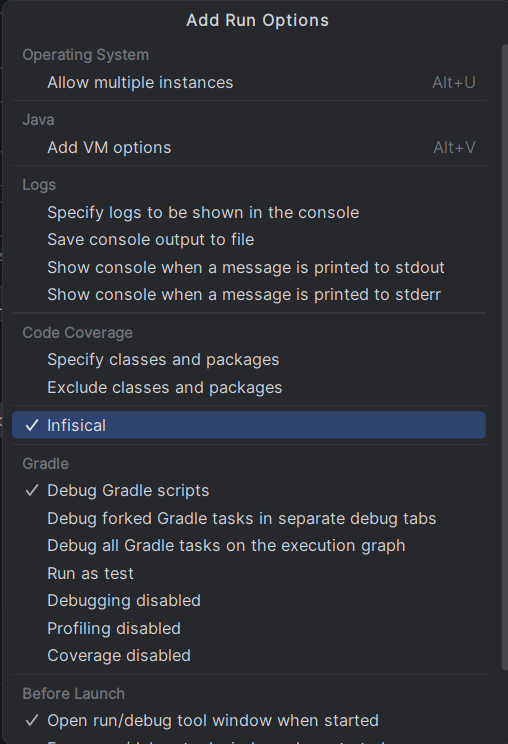
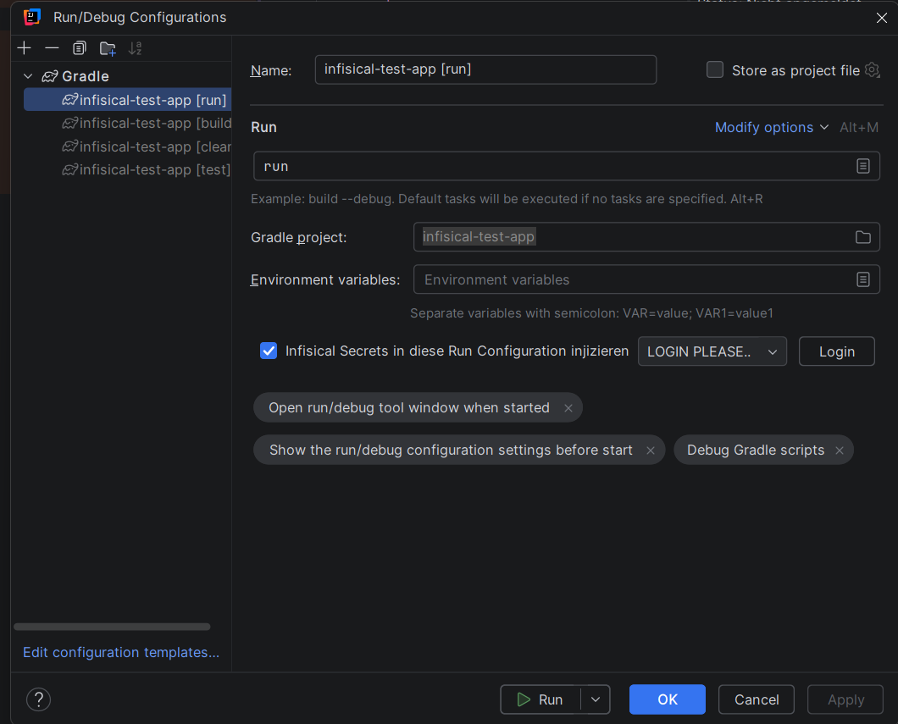
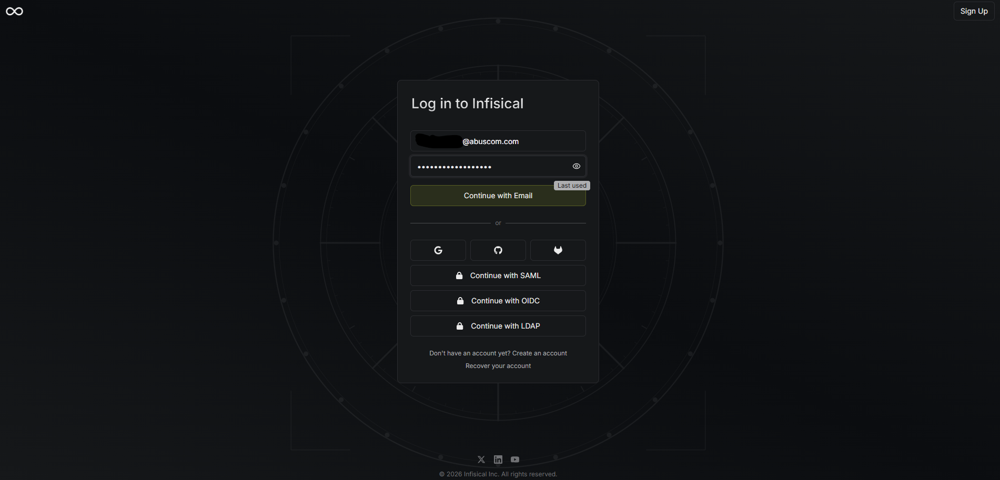
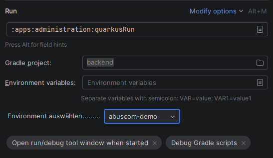
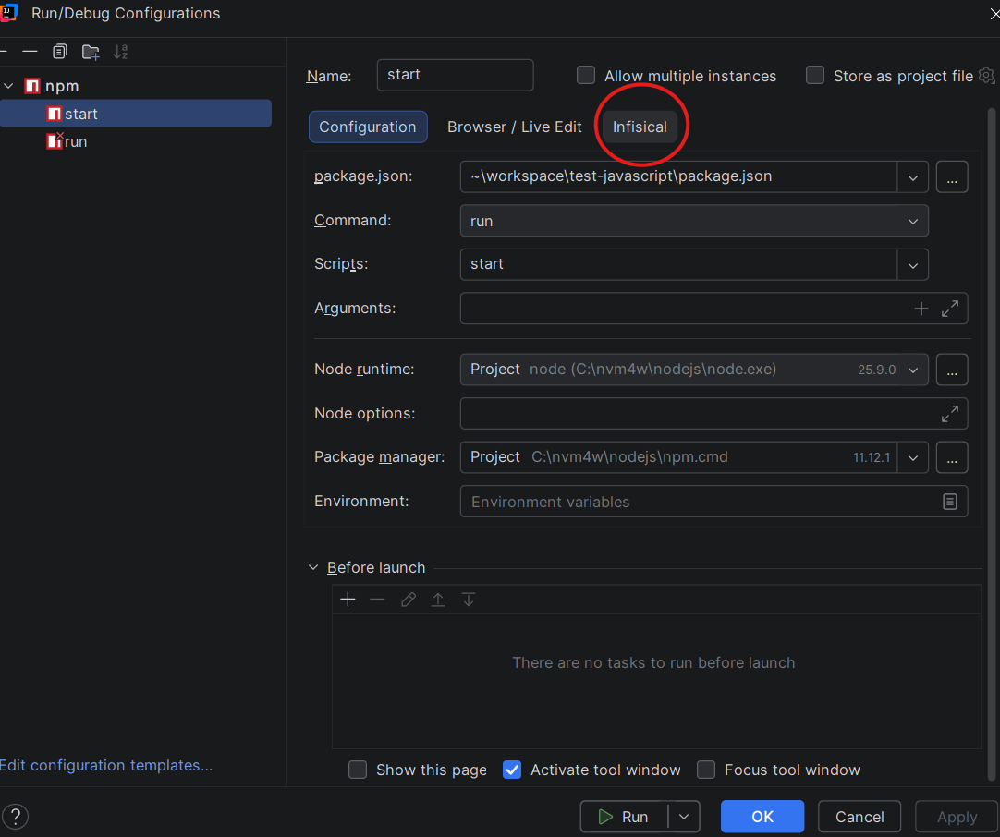

# Plugin Installation & Nutzung

## Installation

1. In der IDE: **File > Settings > Plugins** → Zahnrad-Symbol (⚙) oben rechts → **Manage Plugin Repositories...**

2. Über `+` folgende URL eintragen (einmalig):

   ```
   https://gitlab.abuscom.cloud/api/v4/projects/255/packages/generic/infisical-plugin/repository/updatePlugins.xml
   ```

3. Im Reiter **Marketplace** nach `InfisicalPlugin` suchen und **Install** klicken.

4. IDE neu starten und prüfen, ob das Plugin unter **Plugins** aufgeführt wird.

Zukünftige Updates werden ab dann automatisch von der IDE erkannt und müssen nicht mehr manuell nachinstalliert werden.

## Konfiguration: `.infisical.json`

Damit das Plugin funktioniert, muss im Projekt-Root eine `.infisical.json`-Datei mit folgendem Format vorhanden sein:

```json
{
  "workspaceId": "...…..-....-....-....-............",
  "defaultEnvironment": "dev",
  "gitBranchToEnvironmentMapping": null
}
```

Diese Datei wird über folgenden Befehl erzeugt:

```bash
infisical init
```
(Wenn man Infisical noch nicht installiert hat hier ist der guide: https://infisical.com/docs/cli/overview#debian%2Fubuntu)

Anschließend den Anweisungen im Terminal folgen, um die Verbindung herzustellen.

> **Hinweis:** Diese Datei enthält keine sensiblen Daten und kann daher problemlos ins Repository eingecheckt werden.

## Für Gradle

1. Bestehende Gradle-Run-Configuration aktivieren: Drei-Punkte-Menü neben dem Debug-Symbol → **Edit Configurations** → 
**Modify Options** → Haken bei **Infisical** setzen.

   
2. Danach erscheinen die Login-Option sowie eine Checkbox, mit der Infisical aktiviert oder pausiert werden kann.
   
3. Über das Login-Feld wirst du zur Login-Seite weitergeleitet, auf der du dich mit deinen Zugangsdaten anmeldest.
   
4. Nach dem Login kannst du über das Dropdown-Menü die gewünschte Umgebung (Environment) auswählen.
   

Sobald das Plugin aktiviert ist, können Gradle-Projekte wie gewohnt über **Run** gestartet werden. Lokale Environment-Dateien können vollständig aus dem Projektordner gelöscht werden, da die Werte jetzt über Infisical bereitgestellt werden.


## Für npm

Steuerung bleibt die gleich jedoch muss Infisical nicht manuell aktiviert werden sondern kann direkt über den Reiter **Infisical** neben **Brower / Live Edit** aufgerufen werden.
   

Nach aktivierung sind die Schritte die selbe wie bei Gradle.
> Ausführung über das terminal via npm start wird nicht unterstützt! 

## Für Maven

## Fehlermeldungen

Eine Übersicht aller Fehlermeldungen des Plugins und was sie bedeuten findest du in
[docs/error-messages.md](docs/error-messages.md).
