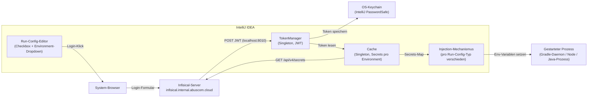
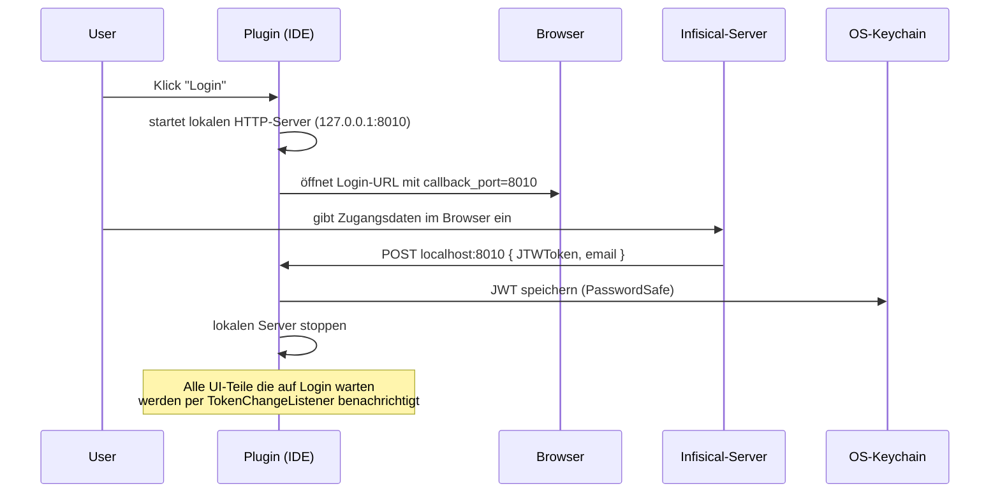
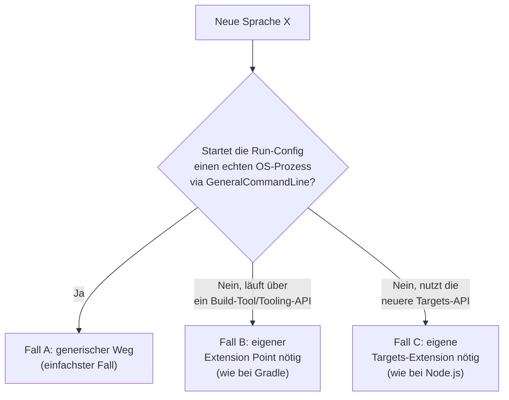

# System-Architektur — InfisicalPlugin

**TL;DR:** IntelliJ-Plugin, das Secrets aus einer selbstgehosteten Infisical-Instanz holt und
automatisch als Umgebungsvariablen in Run-Configurations injiziert. Login läuft über den Browser,
das Token liegt sicher im OS-Keychain, Secrets werden pro Environment gecacht. Die Injektion in
den Zielprozess ist **pro Sprache/Runner unterschiedlich implementiert** — Details dazu in der
letzten Section, die zeigt, wie eine weitere Sprache angebunden wird.

## 1. Grobüberblick



## 2. Komponenten-Überblick

| Komponente | Aufgabe | Wichtige Klasse(n) |
|---|---|---|
| **Login** | Browser-basierter Login, JWT entgegennehmen, sicher speichern | `LoginUser`, `LoginCallBackServer`, `TokenManager` |
| **HTTP-Client** | Generischer REST-Client gegen die Infisical-API | `InfisicalHttpClient` |
| **Secrets-Zugriff** | Secrets/Environments von Infisical abrufen | `SecretClient`, `CurrentEnviroments` |
| **Cache** | Secrets pro Environment zwischenspeichern, Invalidierung, lokale Overrides | `Cache` |
| **Injection** | Secrets als Env-Variablen in den jeweiligen Run-Prozess einschleusen | `InjectIntoGradleProcess`, `InjectIntoNpmProcess`, `InjectSecretsRunConfigurationExtension` |
| **UI** | Checkbox + Environment-Auswahl in der Run-Config, Login-Button | `InjectSecretsSettingsEditor`, `InjectSecretsSettings` |
| **Fehlerbehandlung** | Zentrale Notification-Erzeugung, Auth-Fehler erkennen | `ErrorNotifier` |

## 3. Login-Flow im Detail



Wichtig: Es gibt **kein Refresh-Token**. Läuft das JWT ab (Prüfung rein client-seitig anhand des
`exp`-Claims, keine Signaturprüfung), wird es automatisch gelöscht und der Nutzer muss den
Browser-Login erneut durchlaufen.

## 4. Secrets-Abruf & Cache

- Pro Projekt liegt eine **`.infisical.json`** im Projekt-Root (`workspaceId`, `defaultEnvironment`) —
  eingecheckt, kein Geheimnis.
- Eine optionale **`.infisical.local.json`** (nicht eingecheckt) erlaubt pro-Entwickler-Overrides
  für Secrets, deren Wert maschinenspezifisch ist (z.B. ein lokaler Dateipfad).
- Bei jedem Run-Start wird zuerst nur ein **Metadaten-Call** gemacht (Secret-Keys + Versionsnummer,
  ohne Werte). Nur wenn sich die Environment oder mindestens eine Secret-Version geändert hat,
  werden die echten Werte nachgeladen. **Es gibt keine zeitbasierte Cache-Invalidierung (kein
  TTL)** — Invalidierung ist rein versions-/environment-getrieben.
- Die Environment-Auswahl kommt entweder aus `.infisical.json` (`defaultEnvironment`) oder,
  falls in der Run-Config über das Dropdown gewählt, von dort (überschreibt den Default).

## 5. API-Endpunkte (Infisical-Server)

| Methode & Pfad | Zweck |
|---|---|
| `GET /api/v4/secrets?projectId=&environment=` | Secrets inkl. Werte laden |
| `GET /api/v4/secrets?...&viewSecretValue=false` | Nur Metadaten (Versions-Check) |
| `GET /api/v1/workspace/{projectId}` | Liste der verfügbaren Environments |
| `POST /api/v1/auth/universal-auth/login` | Machine-Identity-Login — **aktuell nicht in Benutzung**, im Code aber vorhanden |

Alle Aufrufe laufen gegen eine fest hinterlegte Basis-URL (interne, selbstgehostete
Infisical-Instanz) mit `Authorization: Bearer <jwt>`.

## 6. Secret-Injektion in den Zielprozess

Das ist der Teil, der am meisten Erklärung braucht: IntelliJ startet je nach Run-Config-Typ den
Zielprozess auf komplett unterschiedliche Weise — ein einzelner, generischer Hook reicht deshalb
nicht.

| Run-Config-Typ | Wie der Prozess gestartet wird | Injektionspunkt im Plugin |
|---|---|---|
| Java / Spring Boot | Direkt über `GeneralCommandLine`/`ProcessBuilder` | `RunConfigurationExtension.updateJavaParameters(...)` |
| Gradle | Über die Gradle Tooling API (kein echter `GeneralCommandLine`) | `GradleExecutionHelperExtension.configureSettings(...)` |
| npm / Node.js | Über die neuere "Targets API" | `JavaScript.nodeRunConfigurationExtension` → `NodeTargetRun.setEnvData(...)` |

Der naheliegende generische SDK-Weg (`patchCommandLine`) greift **nur bei Java-artigen
Prozessen** — Gradle und Node.js starten ihre Prozesse anders und brauchen deshalb ihren eigenen,
sprachspezifischen Extension Point.

## 7. Neue Sprache unterstützen — Schritt für Schritt

Diese Section ist der Einstiegspunkt, wenn das Plugin um eine weitere Sprache (PHP, Python, Go,
Ruby, .NET, ...) erweitert werden soll.

### Schritt 1 — Herausfinden, wie die Ziel-Run-Config ihren Prozess startet

Das entscheidet, welcher der drei Fälle zutrifft:



- **Fall A (häufigster Fall, z.B. viele PHP-/Python-CLI-Run-Configs):** Es reicht, den
  bestehenden generischen Extension Point zu erweitern — keine neue Infrastruktur nötig.
- **Fall B (wie Gradle):** Es muss der build-system-spezifische Extension Point des jeweiligen
  Plugins gefunden werden (meist nur durch Decompilieren des Plugin-JARs herausfindbar, da nicht
  öffentlich dokumentiert).
- **Fall C (wie Node.js):** Es muss die framework-spezifische "Targets API"-Extension des
  jeweiligen Plugins gefunden werden.

### Schritt 2 — Konkrete Umsetzung für Fall A (Standardfall)

1. Neue Extension-Klasse anlegen (Kopie von `InjectSecretsRunConfigurationExtension` als Vorlage).
2. `isApplicableFor(...)` um die neue Run-Config-Klasse erweitern (Klassenname vorher über die
   Doku oder das Plugin-SDK der Zielsprache verifizieren, nicht raten).
3. `patchCommandLine(...)` implementieren:
   `cmdLine.getEnvironment().putAll(Cache.getInstance().getSecrets())`.
4. Einen `ExecutionListener` registrieren, der `Cache.setRunConfigSelection(...)` mit der
   Checkbox-/Dropdown-Auswahl aus der Run-Config füttert (Vorlage: `InjectSecretsRunConfigListenerJava`).
5. Eine eigene `withXyz.xml` anlegen (Vorlage: `withJavaTooling.xml`) und als optionale
   Dependency in `plugin.xml` einhängen:
   ```xml
   <depends optional="true" config-file="withXyz.xml">plugin.id.der.zielsprache</depends>
   ```
6. In `build.gradle.kts` die passende `bundledPlugin("...")`- bzw. Marketplace-Dependency im
   `intellijPlatform { }`-Block ergänzen, damit die neuen API-Klassen zur Compile-Zeit verfügbar sind.
7. UI **wiederverwenden**, nicht neu bauen: `createEditor()` einfach `new InjectSecretsSettingsEditor()`
   zurückgeben lassen — die Checkbox/Dropdown-Logik ist bereits generisch.
8. Tests analog zu `InjectIntoGradleProcessTest`/`InjectIntoNpmProcessTest` ergänzen.

### Schritt 3 — Fälle B und C

Hier gibt es keine Abkürzung: Der passende Extension Point des jeweiligen Sprach-Plugins muss
erst gefunden werden. Die Vorgehensweise dazu (Decompilieren der Plugin-JARs, Suche nach
Schlüsselbegriffen wie `ExecutionHelperExtension`, `LongRunningOperation`, `TargetEnvironment`)
ist ausführlich dokumentiert in:
`InfisicalPlugin/erkenntnisse/2026-07-17-secrets-in-echten-gradle-prozess-injizieren.md`
(am Beispiel Gradle, aber die Methode ist auf jedes andere Build-Tool übertragbar).

## 8. Bekannte Grenzen

- Nur eine fest hinterlegte Infisical-Instanz, keine Mehrfach-Instanz-Unterstützung.
- Kein automatisches Token-Refresh.
- `gitBranchToEnvironmentMapping` ist im `.infisical.json`-Schema vorgesehen, aber nicht implementiert.
- Kein zeitbasierter Cache-Ablauf — nur versions-/environment-getriebene Invalidierung.

## Offene Fragen

Aktueller Stand der offenen Aufgaben: siehe `docs/todos.md`.
